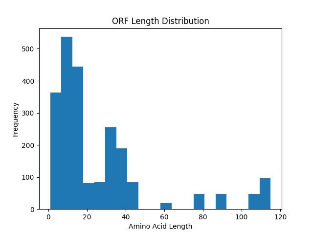
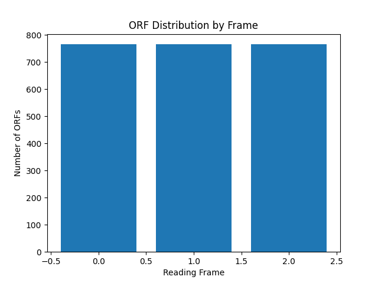

# 🧬 ORF Analyzer

A Python-based bioinformatics tool that identifies Open Reading Frames (ORFs) in DNA sequences and translates them into protein sequences. This project simulates a simplified genomic analysis pipeline used in computational biology and health tech applications.

---

## 🚀 Features

* 📂 Parses DNA sequences from FASTA files
* 🔍 Detects ORFs across all reading frames
* 🔁 Analyzes both forward and reverse complement strands
* 🧬 Translates DNA sequences into protein sequences
* 📊 Visualizes ORF length distributions using plots
* 🧾 Outputs structured results in TSV format

---

## 📊 Example Results

### ORF Length Distribution



### Reading Frame Distribution



---

## 📁 Project Structure

```
orf-analyzer/
├── src/            # Core Python scripts
├── data/           # Input FASTA files
├── results/        # Output files and plots
├── notebook/       # Jupyter Notebook for analysis
└── README.md       # Project documentation
```

---

## ⚙️ Installation

Make sure you have **Python** installed, then install dependencies:

```bash
pip install matplotlib
```

---

## ▶️ Usage

Run the ORF analyzer:

```bash
python src/orf_analyzer.py
```

---

## 🧪 Example Input (FASTA)

```
>sequence_1
ATGAAATTTGGGCCCTAA
```

---

## 📄 Output Format

The program generates a `.tsv` file with the following columns:

```
Sequence   Strand   Frame   Start   End   AminoAcids   Protein
```

---

## 🧠 How It Works

1. Reads DNA sequences from a FASTA file
2. Scans all three reading frames
3. Identifies start (`ATG`) and stop codons (`TAA`, `TAG`, `TGA`)
4. Extracts ORFs and translates them into protein sequences
5. Outputs results and generates visualizations

---

## 🔬 Applications

* Gene prediction and annotation
* Genomic data analysis
* Feature engineering for machine learning models
* Bioinformatics pipelines in health tech

---

## 🚧 Future Improvements

* Identify longest ORF per sequence
* Export translated proteins as FASTA
* Integrate with biological datasets (e.g., real genomes)
* Apply machine learning to classify coding regions

---

## 👨‍💻 Author

James Pham
Biology major transitioning into software engineering and machine learning

---
